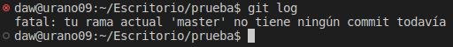

## Ejercicio 1

- **Mostrar el historial de cambios del repositorio.**

Utilizando git log vemos el historial de cambios del repositorio.

## Ejercicio 2

## Ejercicio 3

## Ejercicio 4

## Ejercicio 5

## Ejercicio 6

## Ejercicio 7

## Ejercicio 8

## Ejercicio 9